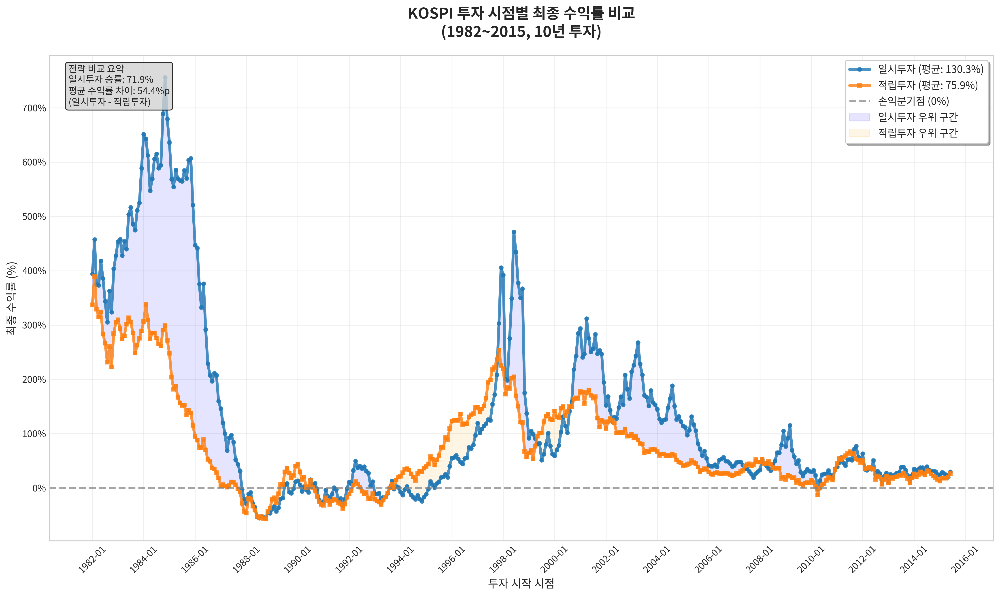

# 일시투자 vs 적립투자 백테스팅 종합 분석 리포트

## 📋 개요
본 리포트는 일시투자와 적립투자(DCA) 전략의 성과를 비교 분석한 결과입니다. 특정 시점의 개별 분석과 34년간의 롤링 분석을 통해 두 전략의 특성과 시장 환경별 유효성을 검증했습니다.

## 🎯 분석 범위
- **분석 기간**: 1982년 1월 ~ 2015년 6월 (34년간)
- **대상 지수**: S&P500, KOSPI
- **투자 조건**: 총 1천만원, 10년 투자기간, 60개월 분할(적립투자)
- **분석 방법**: 개별 시나리오 분석 + 롤링 백테스팅

---

## 🔍 개별 시나리오 분석

### 1. 닷컴버블 정점 (S&P500, 2000년 9월)
**시장 상황**: IT 버블 붕괴 직전 최고점 진입

| 구분 | 일시투자 | 적립투자 | 차이 |
|------|----------|-----------|------|
| **최종 수익률** | -31.0% | -4.05% | **+26.95%p** |
| **CAGR** | -5.25% | -0.60% | +4.65%p |
| **최종 가치** | 689만원 | 959만원 | +270만원 |
| **MDD** | 56.78% | 56.78% | 동일 |

**핵심 시사점**: 시장 고점에서는 적립투자가 손실 완화에 효과적

#### 📈 차트 분석
/누적수익률비교_S&P500_200009.png)
*닷컴버블 붕괴 시기의 누적수익률 변화. 적립투자가 손실 완화에 효과적임을 보여줌*

/포트폴리오가치_S&P500_200009.png)
*포트폴리오 절대 가치 변화. 적립투자가 더 안정적인 성과*

/MDD비교_S&P500_200009.png)
*최대낙폭(MDD) 비교. 두 전략 모두 유사한 최대 손실폭 경험*

### 2. 금융위기 저점 (S&P500, 2009년 3월)
**시장 상황**: 서브프라임 모기지 사태 최저점 진입

| 구분 | 일시투자 | 적립투자 | 차이 |
|------|----------|-----------|------|
| **최종 수익률** | 297.32% | 123.41% | **+173.91%p** |
| **CAGR** | 22.16% | 12.37% | +9.79%p |
| **최종 가치** | 3,973만원 | 2,234만원 | +1,739만원 |
| **MDD** | 19.78% | 21.84% | -2.06%p |
| **샤프 지수** | 0.91 | 0.57 | +0.34 |

**핵심 시사점**: 시장 저점에서는 일시투자가 기회 극대화에 유리

#### 📈 차트 분석
/누적수익률비교_S&P500_200903.png)
*금융위기 저점에서 시작한 투자. 일시투자가 급격한 회복세에서 더 큰 수익 창출*

/포트폴리오가치_S&P500_200903.png)
*포트폴리오 절대 가치 변화. 일시투자의 압도적 성과 확인*

/MDD비교_S&P500_200903.png)
*최대낙폭(MDD) 비교. 두 전략 모두 낮은 손실폭으로 안정적 성과*

### 3. 박스피 구간 (KOSPI, 2010년 1월)
**시장 상황**: 횡보장 시장 환경

| 구분 | 일시투자 | 적립투자 | 차이 |
|------|----------|-----------|------|
| **최종 수익률** | 29.57% | 14.37% | **+15.2%p** |
| **CAGR** | 3.91% | 2.01% | +1.90%p |
| **최종 가치** | 1,295만원 | 1,143만원 | +152만원 |
| **MDD** | 26.50% | 27.79% | -1.29%p |

**핵심 시사점**: 횡보장에서도 일시투자가 소폭 우위, 차이는 제한적

#### 📈 차트 분석
/누적수익률비교_KOSPI_201001.png)
*KOSPI 횡보장 구간의 누적수익률. 일시투자가 소폭 우세하나 차이 제한적*

/포트폴리오가치_KOSPI_201001.png)
*포트폴리오 절대 가치 변화. 두 전략 모두 안정적이나 일시투자가 약간 우위*

/MDD비교_KOSPI_201001.png)
*최대낙폭(MDD) 비교. 유사한 리스크 수준에서 일시투자가 더 나은 성과*

---

## 📊 롤링 분석 결과 (34년간, 402개 기간)

### 전체 성과 비교

#### S&P500 시장
| 구분 | 일시투자 | 적립투자 | 비고 |
|------|----------|-----------|------|
| **평균 수익률** | 142.67% | 96.10% | 일시투자 우세 |
| **평균 CAGR** | 12.49% | 9.44% | +3.05%p |
| **승률** | **79.6%** | 20.4% | 402회 중 320회 승리 |
| **변동성** | 34.78% | 28.70% | 적립투자가 6.1%p 낮음 |

#### KOSPI 시장
| 구분 | 일시투자 | 적립투자 | 비고 |
|------|----------|-----------|------|
| **평균 수익률** | 130.30% | 75.95% | 일시투자 우세 |
| **평균 CAGR** | 9.16% | 6.64% | +2.52%p |
| **승률** | **71.9%** | 28.1% | 402회 중 289회 승리 |
| **변동성** | 46.65% | 37.74% | 적립투자가 8.9%p 낮음 |

### 리스크 특성
- **S&P500**: 최대낙폭 -41.27%, 샤프지수 0.499 (일시투자 기준)
- **KOSPI**: 최대낙폭 -56.79%, 샤프지수 0.218 (일시투자 기준)

### 📊 롤링 분석 차트

#### S&P500 롤링 분석 (1982~2015)

*S&P500 34년간 롤링 분석 종합 결과. 일시투자의 우세한 성과와 시대별 변화 패턴*


*투자 시작 시점별 성과 히트맵. 색상이 진할수록 높은 수익률*


*시간에 따른 수익률 변화 추이. 장기적 상승 트렌드 확인*

#### KOSPI 롤링 분석 (1982~2015)

*KOSPI 34년간 롤링 분석 종합 결과. S&P500 대비 높은 변동성과 상대적으로 낮은 승률*


*KOSPI 투자 시작 시점별 성과 히트맵. 1990년대 후반과 2000년대 초 높은 변동성*


*KOSPI 수익률 변화 추이. 아시아 금융위기와 글로벌 금융위기의 영향 뚜렷*

---

## 💡 핵심 인사이트

### 1. 투자 타이밍의 중요성
```
🔺 시장 고점 진입 → 적립투자 유리 (리스크 완화)
🔻 시장 저점 진입 → 일시투자 유리 (수익 극대화)  
↔️ 횡보장 시장 → 일시투자 소폭 우세
```

### 2. 시장별 특성
- **S&P500**: 상대적으로 안정적, 일시투자 승률 79.6%
- **KOSPI**: 높은 변동성, 일시투자 승률 71.9%
- **공통점**: 두 시장 모두 장기적으로 일시투자가 우세

### 3. 리스크-수익 관계
- **일시투자**: 높은 수익률 + 높은 변동성
- **적립투자**: 낮은 수익률 + 낮은 변동성
- **변동성 감소 효과**: KOSPI(8.9%p) > S&P500(6.1%p)

---

## 🎪 시대별 성과 변화

### 주요 트렌드
1. **1980년대**: 두 시장 모두 일시투자가 압도적 우위
2. **1990년대**: KOSPI에서만 적립투자가 미세하게 우세한 구간 존재
3. **2000년대**: 두 시장 모두 일시투자 우위 지속
4. **2010년대**: 일시투자 우위 유지, 하지만 격차 축소 추세

### 시사점
- 시장 성숙도와 함께 두 전략 간 격차가 축소되는 경향
- 장기적으로는 일시투자가 우세하나, 시장 환경에 따라 차이 발생

---

## 🏁 결론 및 투자 가이드

### ✅ 일시투자가 유리한 경우
- **시장 저점**에서 투자 기회를 포착한 경우
- **장기 상승 추세**가 확실한 시장 환경
- **높은 수익률** 추구가 우선인 적극적 투자자
- **시장 타이밍** 능력에 자신이 있는 경우

### ✅ 적립투자가 유리한 경우
- **시장 고점**에서 투자를 시작하는 경우
- **시장 타이밍 예측**이 어려운 상황
- **리스크 완화**가 우선인 보수적 투자자
- **투자 규율**을 통한 꾸준한 자산 축적 목표

### 📌 최종 권고사항

1. **시장 타이밍보다는 투자 지속성이 중요**
   - 34년간의 데이터에서 두 전략 모두 양호한 성과
   - 개인의 투자 성향과 시장 상황을 종합 고려

2. **하이브리드 전략 고려**
   - 일시투자와 적립투자의 장점을 결합
   - 시장 상황에 따른 유연한 대응

3. **장기 투자 관점 유지**
   - 단기 변동성에 흔들리지 않는 투자 철학
   - 꾸준한 투자 습관이 가장 중요한 성공 요인

---

## 📁 분석 자료 위치
- **개별 분석**: `report/일시투자VS적립투자/개별분석/`
- **롤링 분석**: `report/일시투자VS적립투자/롤링분석/`
- **차트 파일**: 각 시나리오별 4종 차트 (누적수익률, 포트폴리오가치, MDD비교, 투자타이밍효과)

---

*본 분석은 과거 데이터를 기반으로 한 백테스팅 결과이며, 미래 성과를 보장하지 않습니다. 실제 투자 시에는 개인의 재정 상황과 투자 목표를 충분히 고려하시기 바랍니다.*